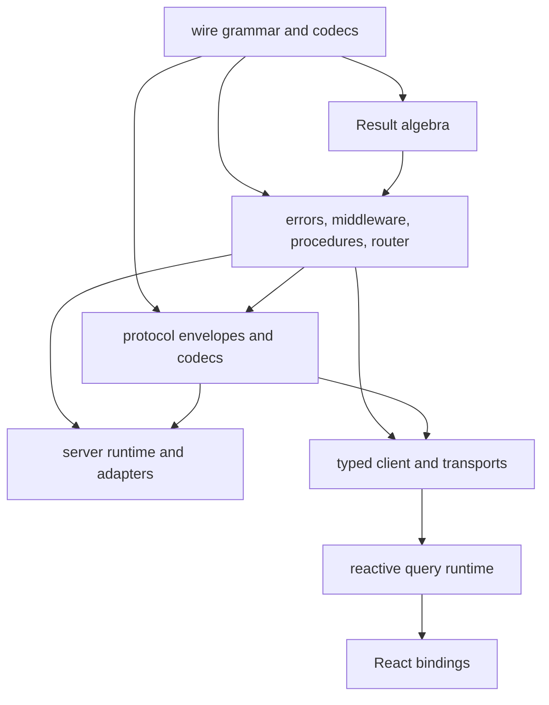

# result-rpc architecture

## Purpose

result-rpc is an RPC regime for React — one vertically integrated library for:

- composing typed `Result` values;
- declaring RPC procedures and their complete recoverable error sets;
- encoding those results across a network boundary;
- resolving process services as a memoized dependency graph;
- growing and narrowing request context through middleware and layers;
- expanding server errors with client and environment failures;
- caching and observing calls through a reactive query runtime;
- owning failures at the right tree position through shells — error
  boundaries generalized to values.

It replaces the public roles of better-result, tRPC, and React Query, and
deliberately nothing more: routing, SSR, and bundling belong to whatever owns
the tree. React bindings are first-class and intended — the shell model is a
React idea. An initial release may use `@tanstack/query-core` as a private
scheduling and cache engine, but no TanStack type or `data | error` API crosses
the result-rpc public boundary.

## Architectural invariants

These are requirements, not aspirations:

1. Every recoverable failure exposed to application code is a tagged structural
   value from a closed operation-specific union.
2. Every tagged error round-trips through the versioned result-rpc serializer before
   it is created, transmitted, cached, persisted, or exposed.
3. Error classes, application-defined prototypes, stacks, causes, arbitrary thrown
   values, and ambient `Error` types never appear in the public recoverable failure
   algebra. Explicit serializer-supported built-ins such as `Date` remain intact.
4. A procedure's declared error registry is the authority for what may cross the
   server boundary.
5. Unknown server exceptions and undeclared or invalid errors are logged and
   replaced with a sanitized `server/internal` error.
6. Client transport and protocol failures extend the procedure union rather than
   forming a second error channel.
7. The query cache stores successful domain values. It does not store `Err` as
   successful query data.
8. Query lifecycle, cancellation, and connection state are modeled separately from
   operation failure.
9. Retry policy has one owner for any operation attempt.
10. Local/server-side calls can be run with the same encode/decode semantics as
    remote calls.
11. Narrowing is subtractive and never additive: a shell may only remove tags an
    enclosing layer provably owns. The contract union is unchanged by it.
12. A tag removed from an operation's union never surfaces as that operation's
    terminal failure state.

## System shape

The project should ship as one versioned npm package with subpath exports. Internal
modules remain separate so dependencies flow in one direction and can be tested in
isolation.



No upward dependency is allowed. In particular:

- the Result algebra knows nothing about RPC or queries;
- procedure contracts know nothing about HTTP or React;
- protocol codecs know nothing about fetch or server frameworks;
- the client knows nothing about React;
- React bindings contain no protocol logic.

## Public package surface

Suggested exports:

```ts
import {
  ok,
  err,
  match,
  matchError,
  error,
  wire,
} from "result-rpc"

import {
  rpc,
} from "result-rpc/contract"

import {
  createFetchHandler,
  createServerClient,
} from "result-rpc/server"

import {
  createClient,
  fetchTransport,
  batchFetchTransport,
} from "result-rpc/client"

import {
  createQueryRuntime,
} from "result-rpc/query"

import {
  ResultRpcProvider,
  ResultRpcHydration,
  useResultQuery,
  useResultSuspenseQuery,
  useResultMutation,
  useResultSubscription,
} from "result-rpc/react"

import {
  createTestClient,
} from "result-rpc/testing"
```

Subpath exports are organizational boundaries, not independently versioned
packages. Contracts, server, client, and UI cannot drift onto incompatible protocol
or error-definition versions.

## Wire layer

### Versioned transparent serializer

The protocol uses a pinned devalue implementation behind a result-rpc serializer
version. It transparently round-trips the values Svelte users expect: `undefined`,
non-finite numbers, `-0`, `Date`, `BigInt`, `RegExp`, `Map`, `Set`, repeated
references, cycles, URLs, array buffers, and typed arrays.
When `Temporal` is installed or native in both runtimes, its standard value types
round-trip through the same pinned profile as well.

Devalue does not promise format stability across releases, so its package version
is not itself the protocol contract. result-rpc pins the implementation, sends a
serializer version in the content type, and changes that version only with an
explicit compatibility strategy.

Unsupported functions, symbols, promises embedded in settled values, and arbitrary
class instances fail serializer preflight. Versioned custom reducer/reviver
profiles are reserved for a later protocol version; the initial release has one
pinned serializer profile and cannot be configured one-sidedly.

Encoded request, response, frame, hydration, and tagged-error byte limits have
conservative defaults. Custom procedure codecs enforce domain-specific string and
collection bounds; aggregate byte limits remain effective for cyclic graphs where
naive depth traversal is unsuitable.

### Codec abstraction

```ts
interface WireCodec<Input, Output> {
  readonly kind: string
  encode(input: Input): DecodeResult<Output>
  decode(value: unknown): DecodeResult<Input>
}
```

`DecodeResult` is an internal Result whose failure contains structured codec issues.
Raw hostile input must not be copied into an application-visible error.

The library supplies primitives, rich built-ins, arrays, records, objects, literals,
unions, optional object keys, and a serializer-preflight codec for recursive graphs.
Adapters for Standard Schema may be added, but every validated value is also checked
by the actual transport serializer. A validator's output type alone is not proof of
wire compatibility.

## Error model

### Runtime value

```ts
interface TaggedError<
  Tag extends string = string,
  Data extends WireValue = WireValue,
> {
  readonly _tag: Tag
  readonly data: Data
}
```

The tagged error container and ordinary structural data are deeply frozen in
development and treated as immutable in production. Serializer-supported built-ins
are defensively copied by their codecs; JavaScript cannot freeze mutable internal
slots such as `Date#setTime`, so readonly usage remains part of the contract. The
error itself has no methods, symbols, prototype requirements, `message`, `name`,
`stack`, or `cause`. A human-readable message may be a deliberately declared field
inside `data`; localization normally happens by `_tag` in the UI.

### Definition

```ts
interface ErrorDefinition<
  Tag extends string,
  Input,
  Data extends WireValue,
> {
  readonly tag: Tag
  readonly codec: WireCodec<Input, Data>
  readonly policy: ErrorPolicy

  (input: Input): TaggedError<Tag, Data>
  is(value: unknown): value is TaggedError<Tag, Data>
}

interface ErrorPolicy {
  readonly httpStatus: number
  readonly retry: "never" | "transient" | "after"
  readonly visibility: "public" | "private"
  readonly severity: "debug" | "info" | "warning" | "error"
}
```

Definitions are nominal objects even though produced error values are structural.
Router composition compares definition identity and tag:

- reusing the same definition is allowed;
- two different definitions with the same tag are a startup error;
- tags must be namespaced strings such as `trip/not-found`;
- framework tags reserve the `client/`, `server/`, `protocol/`, and `control/`
  namespaces.

The `.is` method validates structure, exact tag, and data codec. It never uses
`instanceof`.

### Registry

Tags are flat, namespaced strings (`trip/not-found`); hierarchy is deliberate
non-goal because grouping happens by value — the definition maps shared by
procedures, middleware, shells, layers, and catalogs. The router build is the
registry: it collects every declared definition, rejects a tag bound to two
different definitions (reference identity), and exposes the result as
`router.errors`. Uniqueness at this level is required for ambient shell
claiming, which is keyed by tag alone. `defineErrors(namespace, specs)` derives
tags from keys (template-literal typed), so a tag string is written once or
never.

### Input rejection tier

Malformed input is a `server/bad-request` (400, public, `severity: "warning"`)
carrying bounded path/message issues and never echoing values — emitted by both
the HTTP handler and parity execution, with no incident. `server/internal`
remains reserved for defects. Both are framework-namespace tags every client
union includes and `defectErrors` claims.

### Observability

`createFetchHandler` takes two taps: `onInternalError` (defects, with cause and
incident id) and `onError` (every declared error response, with the error
value, its `ErrorPolicy`, the path, and the HTTP status). `severity` on the
policy exists for the latter.

### Built-in errors

The first version should define at least:

```ts
type FrameworkError =
  | ServerInternal
  | ClientOffline
  | ClientNetworkFailure
  | ClientTimeout
  | ClientHttpFailure
  | ClientProtocolViolation
  | ClientDecodeFailure
```

`server/internal` contains an opaque incident ID and no original exception text.
Transport errors contain only allow-listed, bounded metadata. Response bodies,
headers, cookies, stacks, causes, and arbitrary URLs are never embedded.

## Result layer

### Representation

```ts
type Result<T, E extends TaggedError> =
  | Readonly<{ ok: true; value: T }>
  | Readonly<{ ok: false; error: E }>
```

The representation is a plain discriminated value. It has no prototype and no
misleading `.serialize()` method.

### Composition

Standalone functions preserve error unions:

```ts
map<A, B, E>(result: Result<A, E>, fn: (value: A) => B): Result<B, E>

andThen<A, B, E1, E2>(
  result: Result<A, E1>,
  fn: (value: A) => Result<B, E2>,
): Result<B, E1 | E2>

mapError<A, E1, E2>(
  result: Result<A, E1>,
  fn: (error: E1) => E2,
): Result<A, E2>
```

`matchError` is exhaustive over `_tag`.

Generator composition may be provided through yieldable Result wrappers. A tagged
error itself is never yieldable because adding `Symbol.iterator` would make it a
non-wire value.

## Service layer

`defineService`/`resolveServices` own process-lifetime dependencies (pools,
bindings, clients): an async dependency graph resolved once at startup, memoized
by definition reference identity, cycle-rejected with the offending path. The
resolved record is intended as the root context `createContext` closes over.
Services never produce wire errors — construction failure is a process defect,
not a request failure. This is the deliberate split from request middleware,
which is ordered, per-request, and failure-carrying.

## Contract layer

### Procedure definition

The core type is conceptually:

```ts
interface ProcedureDef<
  Context,
  Input,
  Output,
  ErrorDefinitions,
  Kind extends "query" | "mutation" | "subscription",
> {}
```

Builders accumulate context, input/output codecs, metadata, and error definitions.
The handler must return:

```ts
Result<Output, ErrorOf<ErrorDefinitions>>
```

or its promised equivalent.

Errors are declared before the handler and are authoritative. The implementation
cannot widen a contract by returning an arbitrary tagged object. Code-first
inference may infer success output, but never infers permission for a new error to
cross the wire.

### Middleware

Middleware may declare dependencies with `.after(dep)`: the dependency's output
context becomes the handler's input, its error definitions merge into the
middleware's, and `.use()` flattens the chain in dependency order, deduplicating
by reference identity. The `_types.inputContext` phantom is contravariant
(encoded as a function parameter) so a middleware needing less context is
assignable where more is available — and one needing more is rejected.

A middleware can:

- require and extend context;
- declare errors it may return;
- observe results without changing their wire identity;

Middleware errors union with procedure errors. Collision rules are identical to
router composition. Middleware cannot silently replace a procedure's definition.

```ts
const authenticated = rpc.middleware()
  .errors({ Unauthorized })
  .use(async ({ context, next, errors }) => {
    const user = await authenticate(context.request)
    if (!user) return err(errors.Unauthorized({}))
    return next({ context: { ...context, user } })
  })
```

### Router manifest

Contract construction produces an immutable browser-safe manifest containing, per path:

- operation kind;
- input and output codecs;
- complete error registry;
- error policies.

`app.implement(contract)` attaches the server-only middleware chain and handler.
The server router is therefore a separate runtime object and cannot accidentally
pull repository, authentication, or database code into the browser bundle. The
shared manifest drives client type inference, decoding, documentation, test
clients, and query-key generation; the implementation router drives dispatch.

## Server runtime

### Execution pipeline

```text
route request
  -> validate protocol envelope
  -> decode input
  -> construct context
  -> execute middleware
  -> execute handler
  -> validate returned Result
  -> authorize and encode its error, or encode success
  -> write response
```

Every stage is inside one outer defect boundary.

Expected validation failures use declared framework or procedure errors. An
unexpected throw, rejected promise, undeclared tag, invalid tagged payload, invalid
success output, or encoder defect follows the internal-failure path:

1. generate an incident ID;
2. log the original value, stack, request context, and procedure path through the
   observability interface;
3. emit a valid sanitized `server/internal` envelope;
4. avoid recursively invoking application middleware while handling the failure.

If even the internal envelope cannot be encoded, the adapter emits a minimal static
500 response with a protocol-valid fixed payload.

### Server adapter

The initial adapter consumes and produces Web Standard `Request` and `Response`,
so it can be mounted directly in Bun, Deno, Cloudflare Workers, and modern Node
framework route handlers without runtime-specific result-rpc packages.

The deployment integration owns:

- routing and method checks;
- request body and response size limits;
- optional compression negotiation;
- disconnect-to-abort propagation.

They do not own error classification or serialization policy.

### Observability

Observability receives richer server-local events than clients receive:

```ts
interface FailureEvent {
  incidentId: string
  procedurePath?: string
  phase: "input" | "context" | "middleware" | "handler" | "output" | "error"
  cause: unknown
}
```

The logger implementation is responsible for redaction and retention. The public
error DTO never contains this event.

## Protocol layer

### Versioning

Every request communicates a major protocol version through content type or a
dedicated header. Minor additions must be backward-compatible. Unknown major
versions fail before procedure dispatch.

### Envelopes

Conceptually:

```ts
interface SuccessEnvelope {
  readonly v: 1
  readonly ok: true
  readonly value: WireValue
}

interface FailureEnvelope {
  readonly v: 1
  readonly ok: false
  readonly error: {
    readonly _tag: string
    readonly data: WireValue
  }
}
```

HTTP status is derived from the definition policy. It is not used as the error's
semantic discriminant. Clients still inspect status first so intermediary-generated
failures can be distinguished from valid result-rpc envelopes.

### Decode trust boundary

For a failure response, the client:

1. checks content type, response limits, and envelope structure;
2. verifies the protocol version;
3. looks up `_tag` in the procedure plus framework registry;
4. decodes `data` using that exact definition;
5. constructs the structural error only after successful decoding.

No transmitted `defined`, `inferable`, or type-name flag is trusted. Unknown tags
become `client/protocol-violation`; bad data for a known tag becomes
`client/decode-failure`.

### Batching

A batch is a transport optimization, not a new procedure type. Each item has its
own ID and envelope. Declared failures remain per operation.

A shared transport failure produces the same client boundary tag for each affected
operation. Cancelling one item only aborts the shared request once all remaining
items are cancelled or detached.

The batch transport itself never retries. Each operation's query, subscription, or
direct-call owner applies its tag policy once; retry attempts that become ready in
the same microtask may naturally coalesce into a new batch.

### Streaming and subscriptions

Streams use framed, versioned messages with per-connection sequence IDs. The
operation has two orthogonal states:

- connection lifecycle: connecting, open, reconnecting, paused, closed;
- latest event Result, or a terminal tagged failure.

A transient disconnect that will be reconnected is lifecycle state, not a terminal
`Err`. The initial protocol restarts the subscription after reconnect; applications
needing deduplication include an event ID in the declared output. Once retry policy
is exhausted, the final connection failure is projected into the operation's
client error union.

## Client runtime

### Call pipeline

```text
validate and encode input
  -> transport request
  -> classify cancellation/network/HTTP
  -> validate protocol envelope
  -> decode success or registered error
  -> return Result<T, ProcedureError | ClientBoundaryError>
```

The default client resolves every recoverable outcome:

```ts
Promise<Result<Output, DeclaredErrors | FrameworkErrors>>
```

There is no public `TRPCClientError`, `ThrowableError`, or `unknown` fallback.

The initial release deliberately omits an `unwrap` facade. Integration boundaries
can explicitly throw `result.error` when required without introducing a library
error class or a second error shape.

### Transport classification

Classification order prevents ambiguous failures:

1. explicit cancellation;
2. library-owned timeout;
3. browser-known offline state associated with a failed attempt;
4. fetch/network rejection;
5. non-success HTTP without a valid result-rpc envelope;
6. malformed envelope or unsupported protocol version;
7. tag or payload decode failure.

The built-in transport never adds the original cause to the returned tagged error.

### Cancellation

Cancellation is control flow, not a recoverable operation error. Internally it uses
one library-owned `control/cancelled` sentinel so fetch transports, batching, the
query engine, and subscriptions can recognize it without relying on platform
`AbortError` identity.

The sentinel is tagged and structurally safe, but excluded from procedure and
client error unions. Direct cancellable calls document that abort rejects with the
sentinel; the query runtime consumes it and transitions lifecycle state without
publishing a failure. Calls without a cancellation signal always resolve a Result
unless a client programming invariant is violated.

### Direct and parity clients

- `createClient(transport)` uses the real protocol.
- `createServerClient(router, { mode: "parity" })` executes locally but still runs
  input, output, and error codecs.
Tests and SSR use parity mode. An unchecked server client is deliberately omitted
from the first release so local calls cannot silently diverge from remote behavior.

## Reactive query runtime

### Ownership

result-rpc owns query keys, cache-facing types, query state, mutation state,
subscription state, retry dispatch, hydration, and framework bindings.

The first engine adapter may use `@tanstack/query-core` privately. All references
to its observers, errors, statuses, and options terminate inside the query module.
A small internal `QueryEngine` port allows later replacement, but the port should
model result-rpc semantics rather than mirror TanStack's entire API.

### Cache rule

Successful values are cached as `T`. Tagged failures use the engine's internal
failure mechanism so retries, failure counts, pause/resume, and error-boundary
integration work correctly. `Result<T, E>` is never treated as successful cache
data.

The internal query function is equivalent to:

```ts
async function execute(): Promise<T> {
  const result = await client.procedure(input)
  if (!result.ok) throw result.error
  return result.value
}
```

This rejection is private control flow inside the engine. Public observers project
it back into the same tagged Result union.

### Public query state

```ts
type QueryState<T, E extends TaggedError> =
  | {
      state: "pending"
      result: undefined
      fetch: "fetching" | "paused"
    }
  | {
      state: "success"
      result: Result<T, never> & { ok: true }
      fetch: "idle" | "fetching" | "paused"
    }
  | {
      state: "failure"
      result: Result<never, E> & { ok: false }
      previous?: T
      fetch: "idle" | "fetching" | "paused"
    }
```

`previous` preserves usable cached data after a failed background refetch. It does
not create another failure channel. The state also exposes refetch, timestamps,
failure count, staleness, and invalidation controls without exposing raw engine
`data` or `error` properties.

Offline pausing remains `fetch: "paused"`. It becomes `client/offline` only when a
configured policy settles the attempt as a failure.

### Retry

The query runtime is the retry owner for queries and mutations executed through it.
It obtains policy from the registered error definition, not by parsing HTTP status
or message strings.

Default behavior:

- domain, authentication, authorization, validation, not-found, protocol, and
  decode errors do not retry;
- network, timeout, and explicitly transient server errors use bounded backoff;
- retry-after errors expose validated delay data through their definition;
- offline work pauses rather than consuming attempts;
- cancellation consumes no retry budget.

The core client does not also retry when invoked by the query runtime. Direct calls
may opt into a standalone retry executor using the same policies.

### Mutations

Mutations use the same tagged union and public Result projection. They additionally
model submitted variables, optimistic context, and reset state. Optimistic updates
must register rollback behavior; a tagged mutation failure triggers rollback before
observers receive the final failure state.

Mutation cancellation support is explicit because platform transports cannot
always undo server-side effects after dispatch.

### Hydration and persistence

result-rpc owns a versioned cache codec. Hydration validates:

- cache format version;
- procedure/key identity;
- successful data codec;
- serializer payload bounds.

Errors remain structural values, so no class revival is required. The initial
release dehydrates successful query data only.

Failed queries, cancellation, and transient connection state are never persisted.

## React bindings

React bindings subscribe to the framework-neutral query runtime through
`useSyncExternalStore`. They provide:

- a provider for the runtime instance;
- suspense and non-suspense query hooks;
- mutation and subscription hooks;
- SSR preloading and hydration helpers.

Suspense throws the pending promise but returns failures through the ordinary
Result state after settlement.

### Client proxy

The client is a path-building proxy. It is await-safe: resolving a promise to a
proxy node reads `.then`, which the proxy follows only if the path exists in
the router; otherwise it returns `undefined` so thenable checks pass through.

### Shells

A shell is a declared layer of failure ownership. `defineShell` takes an error
definition map, an effect, an optional handler, and an optional `provide` that
builds the value the layer guarantees. `from:` links it to its enclosing layer.

Claiming and narrowing are two halves with different carriers:

**Claiming is ambient.** A mounted shell provider registers a claim entry in a
scope context; every base hook (`useResultQuery`, `useResultMutation`,
`useResultSubscription`, suspense) consults the mounted scope, innermost owner
first. A claimed tag therefore never becomes a terminal failure anywhere
beneath its owner, regardless of which hook observed it — the shell is a
monitor on all procedure activity below it, keyed purely by the wire contract's
tags, with no knowledge of the procedures involved. `useActive()` aggregates
everything absorbed, not just shell-hook traffic.

**Narrowing is carried by the shell *value*, not by tree position:**

- the accumulated handled set is computed at the type level by walking `from:`,
  so `Shell.useQuery` returns `ExcludeTags<ProcedureError, Handled>` without any
  hand-written union;
- a shell hook cannot be reached without importing the module that declares the
  layer's handler, so the subtraction is not a claim the type system takes on
  faith from context;
- mount position is verified at runtime — a provider outside its `from:` layer
  throws, and shell hooks eagerly assert their whole chain is mounted, so the
  narrowed union can never outrun its owners. Plain hooks outside any provider
  keep the full union and surface every failure; their union under a provider
  is a sound over-approximation (it may list tags that can no longer surface).

Definition-time checks reject a tag claimed twice in one chain and a shell that
claims nothing.

Projection rules for a claimed error:

| Effect | Query | Mutation | Subscription |
| --- | --- | --- | --- |
| `pause` | `fetch: "paused"`; stale success is retained, otherwise `pending` | state returns to `idle`, `mutate` rejects with the control sentinel | `connection: "paused"`, `result` cleared |
| `escalate` | structural tagged value thrown during render | same | same |

Escalation throws the `TaggedError` itself rather than a wrapper, so a boundary
fallback can `matchError` on it. The library does not introduce a second public
wrapper error shape.

Each shell instance owns a small store of the errors it is currently holding,
exposed as an aggregate through `useActive()`. Connectivity is a property of the
application, not of any single operation, so the ambient tier is observed rather
than branched on.

### Layers

`defineLayer` is the shared declaration behind a shell that also has a server
half: a name, a context key, a `provides` wire codec, and an error map. Three
derivations close over that one declaration:

- `layer.middleware(app, resolve)` — server middleware adding the value to
  context under the key and contributing the union;
- `layer.contract(app)` / `layer.implement(app, contract, ...middlewares)` — the
  context procedure (`{} -> value` with the layer union) whose handler is
  derived: it returns the value the middleware placed in context;
- `layerShell(layer, { from, procedure, onError })` — the React sibling: its
  Provider loads the value through the context procedure under the enclosing
  shells, provides it, and claims the layer union.

An empty error map declares an optional layer: it always establishes (a nullable
value) and its shell claims nothing. `layer.require({ provides, errors, refine })`
derives a required layer that narrows the same context key — `User | null`
becomes `User` — with middleware that needs no resolver and a union contributed
by the refinement. Context therefore grows and narrows monotonically through the
middleware chain, and the client onion mirrors it as nested providers.

`LayerShape` is the structural surface `layerShell` accepts, so base and refined
layers derive shells identically. The `procedure:` option also accepts a
selector `(client) => procedure`, resolved through the enclosing provider via
`useResultClient()` at render time — shells therefore define at module level,
before any client instance exists. The runtime exposes its `client` for this
and for router loader contexts.

## Router integration

Deliberately none in the package. Shells are providers and hooks, so any
router composes; the route-fragment pattern (shell Provider as route
component, layer prefetch as route loader) lives as app-owned glue in
`examples/05-router-glue/router-glue.tsx`. `getLayerProcedureResolver` is the
one advanced export that makes such glue possible: it returns a layer shell's
context-procedure resolver so integrations can derive loaders.

## Security and resource limits

The core protocol enforces:

- aggregate request, response, frame, hydration, and tagged-error byte limits;
- maximum batch item counts;
- prototype-pollution-safe object decoding;
- redaction of secrets from logs and incident metadata;
- fixed public text for internal failures;
- no reflection of malformed payloads into returned errors;
- no client trust in server-supplied type assertions.

Deployment adapters additionally own origin/CSRF policy and platform-specific
handler or streaming-idle timeouts. Domain codecs own tighter string, array, map,
and nesting constraints where those limits are meaningful to the procedure.

Error visibility metadata can restrict which tags are legal on public transports.
A private error returned by a public procedure is treated as an undeclared failure
and converted to `server/internal`.

## Testing architecture

### Compile-time tests

Assert that:

- non-tagged and non-wire error types cannot be declared;
- middleware and procedure errors form the expected union;
- collisions fail;
- exhaustive matching requires every tag;
- client boundary errors expand each procedure correctly;
- no public query type contains raw `Error`, `unknown`, `data`, or engine errors.

### Codec and protocol tests

- byte-level round trips for every built-in error;
- rich-value and cyclic round trips, repeated identity, unsupported functions and
  classes, malformed serializer payloads, and resource limits;
- hostile unknown tags and invalid payloads;
- protocol version mismatch;
- server exception sanitization;
- malformed proxy and intermediary responses.

### Runtime conformance coverage

Transport and Web Standard server tests cover success, declared failure, internal
failure, timeout, cancellation, batching, disconnect, streaming, and limits.

The query runtime tests cover retries, offline subscription pause/reconnect,
mutation cancellation, background refetch failure with `previous`, optimistic
rollback, dehydration, hydration, and hostile hydrated data.

### Type and runtime parity

The test suite collectively verifies observable Result and error-union parity through:

- remote HTTP client;
- batched client;
- parity server client;
- query runtime;
- SSR hydration.

## Initial implementation sequence

1. Wire grammar, limits, codec primitives, and structural tagged-error definitions.
2. Plain Result algebra, exhaustive matching, and compile-time union tests.
3. Procedure/middleware/router contracts and collision-safe error registries.
4. In-process parity execution with server defect sanitization.
5. Versioned unary HTTP protocol, fetch transport, and client classification.
6. Query runtime backed privately by `@tanstack/query-core`.
7. React bindings and SSR hydration.
8. Batching.
9. Mutations and optimistic updates.
10. Streaming and subscriptions.
11. Protocol hardening and conformance audit.

Each phase must preserve the architectural invariants. In particular, batching,
streaming, SSR, and framework adapters cannot introduce a second error channel or
bypass the same codecs used by unary remote calls.

## Known gaps

Shell teardown while claimed operations are held is not yet specified. A layer
that responds to its claim by unmounting the subtree — the session-expired
redirect — discards observers that are mid-flight. The disposition of that work
(cancel versus settle into a discarded cache entry) is currently whatever the
query runtime's unmount path does, and must be pinned down before applications
depend on it.

## Deliberate non-goals for the first release

- compatibility wrappers around better-result or tRPC types;
- exposing TanStack Query option or observer types;
- unversioned or one-sided pluggable serializers;
- automatic transmission of `Error`, stack, or cause;
- inference of wire permission from values returned by a handler;
- OpenAPI generation before the protocol and error registry stabilize;
- multiple simultaneous retry layers;
- class revival or `instanceof` compatibility across the wire.
- runtime-specific wrappers around the Web Standard server adapter.

These can be revisited only if they preserve the closed, structural, wire-validated
failure algebra.
